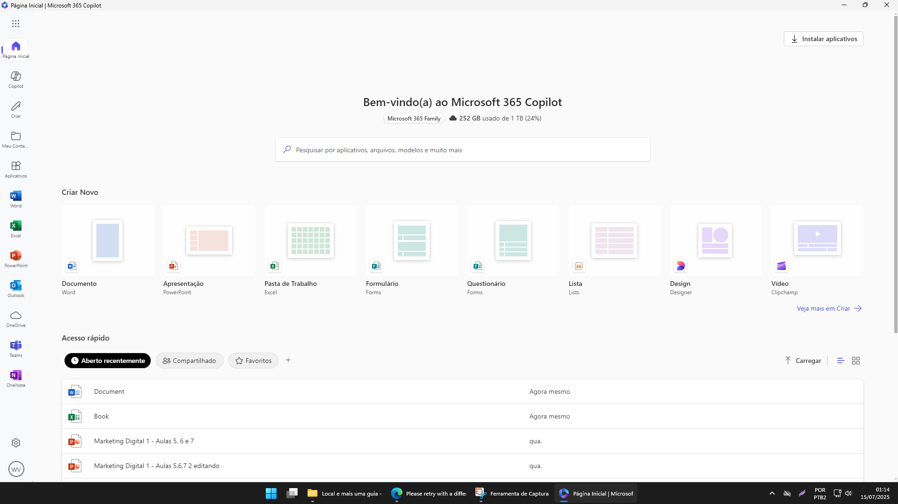

# Sobre a aplicação

Aplicação desenvolvida usando Electron. Empacotada usando Eléctron Builder. Ela basicamente abre a tela de login do Microsoft Office 365.

1. Baixe o arquivo Microsoft_Office_365_Portable_20250715-00h30 Latest.
2. Descompacte-o e abra a pasta extraída.
3. Clique com o botão direito no arquivo Install.bat e o execute como administrador.
4. O aplicativo foi instalado com sucesso.
5. Apague a pasta Microsoft_Office_365_Portable_20250715-00h30 e o arquivo Microsoft_Office_365_Portable_20250715-00h30.zip, pois não são mais necessários.

Vídeo ensinando a instalar:
https://youtu.be/DAcmosUJKyM

---

# About the application

Application developed using Electron. Packaged using AppImageTools. It basically opens the Microsoft Office 365 login screen.

1. Download the file Microsoft_Office_365_Portable_20250715-00h30 Latest.
2. Extract it and open the extracted folder.
3. Right-click the Install.bat file and run it as administrator.
4. The application has been installed successfully.
5. Delete the folder Microsoft_Office_365_Portable_20250715-00h30 and the file Microsoft_Office_365_Portable_20250715-00h30.zip, as they are no longer needed.

Video showing how to install:
https://youtu.be/DAcmosUJKyM
